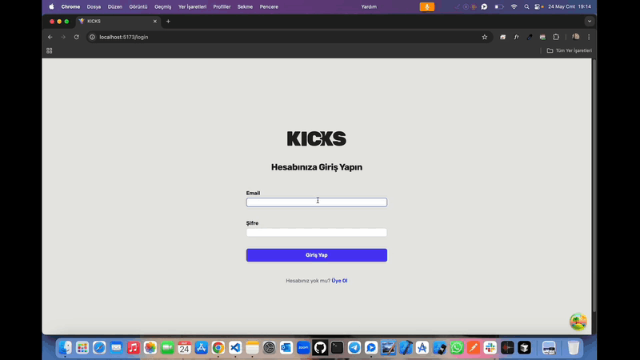

# Kicks-Shoe 👟

<li>Bu proje admin paneli ve kullanıcı arayüzü ile tasarlanmış ayakkabı e-ticaret sitesidir.</li>
<li>Herbir ayakkabı ürünü için detay özelliği eklenmiştir.</li>
<li>Kullanıcı girişi yapma,yeni hesap için üye olma panelleri mevcuttur.</li>
<li>Admin paneli sayesinde yeni ürün ekleme,düzenleme,silme özelliği entegre edilmiştir.</li>
<li>Kullanıcı dostu modern responsive tasarımı vardır.</li>

# Kullanılan Teknolojiler 🎨

<li>⭐ TypeScript</li>
<li>⭐ React</li>
<li>⭐ Vite</li>
<li>⭐ Tanstack-Devtools</li>
<li>⭐ Formik</li>
<li>⭐ Yup</li>
<li>⭐ Tailwindcss</li>
<li>⭐ Toastify</li>
<li>⭐ React-İcons</li>
<li>⭐ React-Query</li>

# Ekran Görüntüsü 🎥
    

# İletişim 📩
yunusemreoral@hotmail.com.tr
